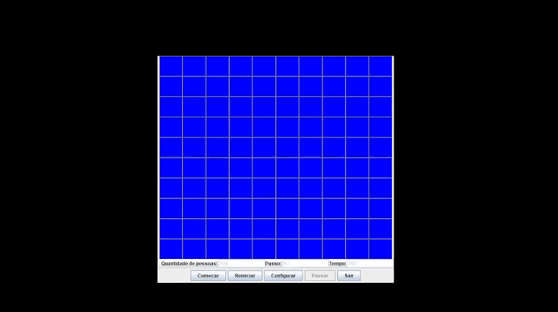

# Simulador do problema de Josephus 

    

 

Este repositório contém os artefatos desenvolvidos para uma aplicação em Java que simula, de forma gráfica e interativa, o Problema de Josephus.

A aplicação permite visualizar a execução do algoritmo passo a passo, facilitando o entendimento do processo até a definição do sobrevivente.

---

## Funcionalidades da aplicação

- Simulação completa do problema de Josephus
- Visualização passo a passo da eliminação dos indivíduos
- Configuração personalizada da simulação:  
    - Quantidade de indivíduos  
    - Intervalo de eliminação (passo, apenas valores positivos)  
    - Tempo de execução (em segundos)  

---

## Tecnologias usadas

- Java (OOP)
- Java Swing (para interface gráfica)

